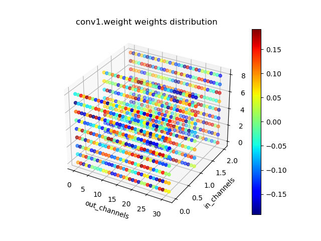

本项目可以实现最简单的通道剪枝，方便入门通道剪枝的人学习。

环境说明：

pytorch:1.7

seaborn:0.11.0

matplotlib:3.4.3

logurn:0.5.3


在mymodel.py中，自定了一个卷积网络(仅包含卷积层和激活函数层)，将对该定义的网络进行剪枝。

prunmodel_.py参数说明：

--prune:是否开启剪枝功能

--percent:剪枝率，默认0.5

--save：是否保存模型

--plt:绘制2D卷积权重图

--plt_3d：绘制3D卷积权重图

--layer_name:需要绘制的权重层名字


# 通道剪枝

```shell
python prunmodel_.py --prune --percent 0.5
```

剪枝前网络：

```powershell
model: Model(
  (conv1): Conv2d(3, 32, kernel_size=(3, 3), stride=(1, 1), padding=(1, 1), bias=False)
  (act1): ReLU(inplace=True)
  (conv2): Conv2d(32, 64, kernel_size=(3, 3), stride=(1, 1), padding=(1, 1), bias=False)
  (act2): ReLU(inplace=True)
  (conv3): Conv2d(64, 128, kernel_size=(3, 3), stride=(1, 1), padding=(1, 1), bias=False)
  (act3): ReLU(inplace=True)
  (conv4): Conv2d(128, 256, kernel_size=(3, 3), stride=(1, 1), padding=(1, 1), bias=False)
  (act4): ReLU(inplace=True)
  (conv5): Conv2d(256, 512, kernel_size=(3, 3), stride=(1, 1), padding=(1, 1), bias=False)
  (act5): ReLU(inplace=True)
  (conv6): Conv2d(512, 1024, kernel_size=(3, 3), stride=(1, 1), padding=(1, 1), bias=False)
  (act6): ReLU(inplace=True)
  (conv7): Conv2d(1024, 2048, kernel_size=(3, 3), stride=(1, 1), padding=(1, 1), bias=False)
  (act7): ReLU(inplace=True)
  (conv8): Conv2d(2048, 4096, kernel_size=(3, 3), stride=(1, 1), padding=(1, 1), bias=False)
)

```

剪枝后：

```powershell
 pruned model: Model(
  (conv1): Conv2d(3, 16, kernel_size=(3, 3), stride=(1, 1), padding=(1, 1), bias=False)
  (act1): ReLU(inplace=True)
  (conv2): Conv2d(16, 32, kernel_size=(3, 3), stride=(1, 1), padding=(1, 1), bias=False)
  (act2): ReLU(inplace=True)
  (conv3): Conv2d(32, 64, kernel_size=(3, 3), stride=(1, 1), padding=(1, 1), bias=False)
  (act3): ReLU(inplace=True)
  (conv4): Conv2d(64, 128, kernel_size=(3, 3), stride=(1, 1), padding=(1, 1), bias=False)
  (act4): ReLU(inplace=True)
  (conv5): Conv2d(128, 256, kernel_size=(3, 3), stride=(1, 1), padding=(1, 1), bias=False)
  (act5): ReLU(inplace=True)
  (conv6): Conv2d(256, 512, kernel_size=(3, 3), stride=(1, 1), padding=(1, 1), bias=False)
  (act6): ReLU(inplace=True)
  (conv7): Conv2d(512, 1024, kernel_size=(3, 3), stride=(1, 1), padding=(1, 1), bias=False)
  (act7): ReLU(inplace=True)
  (conv8): Conv2d(1024, 2048, kernel_size=(3, 3), stride=(1, 1), padding=(1, 1), bias=False)
)

```

参数对比：

> Number of parameter: 100.66M
>
> Number of pruned model parameter: 25.16M

# 权重绘制

本项目默认对未剪枝前网络进行绘制。

均以conv1这一层为例。

## 绘制2D权重图像

```shell
python prunmodel_.py --plt --layer_name 'conv1.weight' 
```

<p align="center">
  
</p>

## 绘制3D权重图像

```python
python prunmodel_.py --plt_3d --layer_name 'conv1.weight' 
```


<p align="center">
  
</p>

# 通道剪枝详细原理

本项目通道剪枝详细原理：https://blog.csdn.net/z240626191s/article/details/130235286?spm=1001.2014.3001.5501

注意：本项目现在仅仅支持卷积层的剪枝，后续会更新BN层以及其他类型网络。YOLO系列剪枝可以看我github


